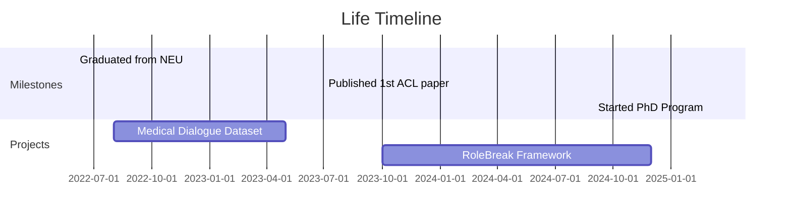

## 🌟 About Me 

As a passionate researcher in NLP and dialogue systems, I am currently pursuing my PhD at Harbin Institute of Technology, Shenzhen. My work focuses on exploring the intersection of personality modeling and safe AI systems.

🔭 **Current Focus**:  
- Role-playing dialogue agent safety
- Personality-aware language models
- Human-AI interaction simulation

📬 **Let's Connect**:  
 
 

## 🎓 Academic Journey
<table style="width: 100%; border-collapse: collapse; margin: 25px 0;">
<tr>
<td style="width: 30%; border-right: 2px solid #eee; padding-right: 20px;">
<h3>📅 Timeline</h3>
<ul style="list-style: none; padding-left: 0;">
<li>2025.03 - Now   HIT Shenzhen</li>
<li>2022.06 - 2025.01   Tianjin Univ</li>
<li>2018.09 - 2022.06   NEU Qinhuangdao</li>
</ul>
</td>
<td style="padding-left: 20px;">
<h3>🏆 Research Milestones</h3>
<ul>
<li>Published 7 papers in CCF-A/B conferences</li>
<li>Led CCF-Baidu funded project on emotional agents</li>
<li>Developed Chinese-medical-dialogue-data (⭐ 1.2k GitHub stars)</li>
</ul>
</td>
</tr>
</table>

## 📚 Featured Publications

<h4 style="margin-top: 0;">The Power of Personality (Arxiv)</h4>

Proposed novel evaluation framework for LLM agents using human simulation paradigm.  
<strong>Contribution</strong>: Developed 10+ personality dimensions evaluation metrics

<h4 style="margin-top: 0;">MORPHEUS (EMNLP 2024)</h4>

Innovative latent space modeling approach for personalized dialogue systems.  
<strong>Impact</strong>: Achieved 15% performance improvement on PersonaChat dataset

## 🌈 Life Beyond Research
### 🎨 Creative Corner
- **📸 Photography**: Urban landscapes | AI-generated art
- **🎮 Game Design**: Developed 2 text-based RPG games
- **📖 Technical Writing**: Regular contributor to [AI Weekly Digest](https://example.com)

### 🎉 Highlight Events

### 🤝 Friends & Colleagues
| Name          | Affiliation               | Field                 | Link                  |
|---------------|---------------------------|-----------------------|-----------------------|
| Dr. Bo Wang   | Tianjin University        | Dialogue Systems      | [Lab](https://...)    |
| Jiao Ou       | Microsoft Research Asia   | LLM Evaluation        | [Blog](https://...)   |

## 📬 Get in Touch

Let's discuss AI safety, role-playing systems, or photography!

<a href="mailto:your@email.com" style="background: #4CAF50; color: white; padding: 10px 20px; border-radius: 5px; text-decoration: none;">Contact Me</a>

