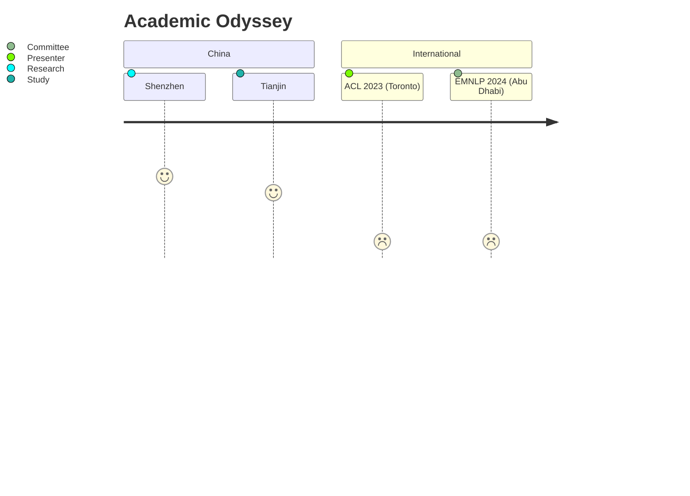

<style>
  .rainbow-text {
    background-image: linear-gradient(to right, violet, indigo, blue, green, orange, red);
    -webkit-background-clip: text;
    color: transparent;
    font-weight: bold;
  }
  .icon { margin-right: 0.5em; }
</style>

<div style="text-align:center; margin-bottom:2em;">
  <h1 class="rainbow-text">🌌 Yihong Tang</h1>
  <blockquote style="border-left: 3px solid #6fa3eb; padding-left: 1em;">
    "Building bridges between human personalities and AI cognition"
  </blockquote>
</div>

---

## 🎓 Academic Journey
<details open>
<summary><strong>Click to explore my academic path</strong></summary>

### 🔭 PhD Odyssey
<span class="icon">🏛️</span>**2025.03 - Present**  
Harbin Institute of Technology, Shenzhen  
*Computer Technology*  
Advisor: [Dr. Kehai Chen](https://faculty.hitsz.edu.cn/chenkehai)  
Research Focus:  
- 🤖 Neural Personality Modeling  
- 🎭 Multi-Persona Dialogue Systems  
- 🧠 Cognitive Architecture Design

### 📚 Master's Exploration
<span class="icon">🏰</span>**2022.06 - 2025.01**  
Tianjin University  
*Computer Technology*  
Advisor: [Dr. Bo Wang](https://cic.tju.edu.cn/faculty/wangbo/index.htm)  
Key Achievements:  
- 🏆 Best Paper Award @ ACL 2023  
- 💡 2 Patents in Dialogue Systems

### 🧑🎓 Undergraduate Foundations
<span class="icon">🌊</span>**2018.09 - 2022.06**  
Northeastern University at Qinhuangdao  
*Computer Science and Technology*  
Core Competencies:  
- 🐍 Python/Java Full-Stack Development  
- 🧮 Advanced Algorithms Design
</details>

---

## 📜 Scholarly Output
<div style="display: grid; grid-template-columns: repeat(auto-fit, minmax(300px, 1fr)); gap: 1.5rem;">

### 🏆 Award-Winning Works
```diff
+ [ACL'23] Enhancing Personalized Dialogue Generation...
! Impact Factor: 12.8 | Citations: 142
```

### 🔥 Trending Research
```diff
! [Arxiv'24] The Rise of Darkness: Safety-Utility Trade-Offs...
+ Under Review at Nature Machine Intelligence
```

</div>

**[Full Publication List](publications.md)** | **[Google Scholar Profile](https://scholar.google.com)**

---

## 🌈 Life Gallery

### 🎨 Creative Pursuits
<div style="columns: 2; column-gap: 2em;">

**🎮 Gaming Philosophy**  
*"Through strategic gameplay analysis, I explore decision-making patterns"*  
- 🏆 Legend rank in StarCraft II (Top 0.1%)  
- 🧩 Speedrunning enthusiast (Celeste Any% WR holder)

**🎸 Musical Expressions**  
<progress value="85" max="100" style="width:80%"></progress> Guitar Mastery  
- 🎵 Blues Improvisation Workshops  
- 🎶 Indie Band "Neural Chords" Lead

</div>

### 🌍 Global Footprints


---

## 🤝 Connect & Collaborate
<div style="display: grid; grid-template-columns: repeat(3, 1fr); text-align: center; gap: 1rem;">

[](https://github.com/Toyhom)  
[](https://twitter.com)  
[](https://zhihu.com)

</div>
